# Домашнее задание к занятию "Уязвимости и атаки на информационные системы" - Tarkov Viktor

### Инструкция по выполнению домашнего задания

   1. Сделайте `fork` данного репозитория к себе в Github и переименуйте его по названию или номеру занятия, например, https://github.com/имя-вашего-репозитория/git-hw или  https://github.com/имя-вашего-репозитория/7-1-ansible-hw).
   2. Выполните клонирование данного репозитория к себе на ПК с помощью команды `git clone`.
   3. Выполните домашнее задание и заполните у себя локально этот файл README.md:
      - впишите вверху название занятия и вашу фамилию и имя
      - в каждом задании добавьте решение в требуемом виде (текст/код/скриншоты/ссылка)
      - для корректного добавления скриншотов воспользуйтесь [инструкцией "Как вставить скриншот в шаблон с решением](https://github.com/netology-code/sys-pattern-homework/blob/main/screen-instruction.md)
      - при оформлении используйте возможности языка разметки md (коротко об этом можно посмотреть в [инструкции  по MarkDown](https://github.com/netology-code/sys-pattern-homework/blob/main/md-instruction.md))
   4. После завершения работы над домашним заданием сделайте коммит (`git commit -m "comment"`) и отправьте его на Github (`git push origin`);
   5. Для проверки домашнего задания преподавателем в личном кабинете прикрепите и отправьте ссылку на решение в виде md-файла в вашем Github.
   6. Любые вопросы по выполнению заданий спрашивайте в чате учебной группы и/или в разделе “Вопросы по заданию” в личном кабинете.
   
Желаем успехов в выполнении домашнего задания!
   
### Дополнительные материалы, которые могут быть полезны для выполнения задания

1. [Руководство по оформлению Markdown файлов](https://gist.github.com/Jekins/2bf2d0638163f1294637#Code)

---

### Задание 1

Скачайте и установите виртуальную машину Metasploitable: https://sourceforge.net/projects/metasploitable/.

Это типовая ОС для экспериментов в области информационной безопасности, с которой следует начать при анализе уязвимостей.

Просканируйте эту виртуальную машину, используя nmap.

Попробуйте найти уязвимости, которым подвержена эта виртуальная машина.

Сами уязвимости можно поискать на сайте https://www.exploit-db.com/.

Для этого нужно в поиске ввести название сетевой службы, обнаруженной на атакуемой машине, и выбрать подходящие по версии уязвимости.

Ответьте на следующие вопросы:

   - Какие сетевые службы в ней разрешены?
   - Какие уязвимости были вами обнаружены? (список со ссылками: достаточно трёх уязвимостей)

*Приведите ответ в свободной форме.*

   - Установка виртуальной машины Metasploitable

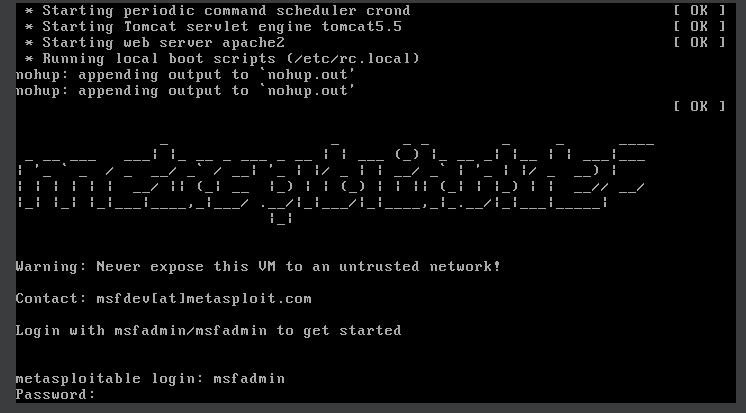
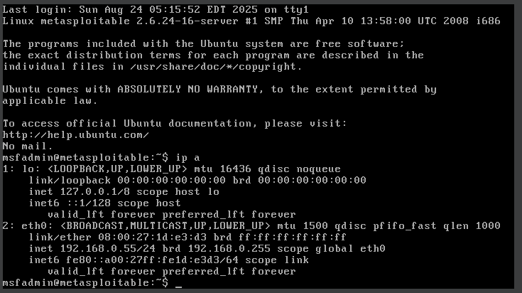
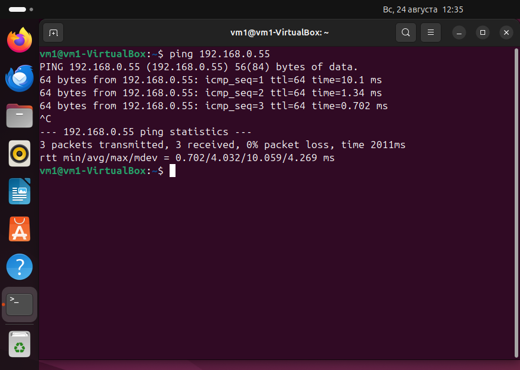

   - Какие сетевые службы в ней разрешены?

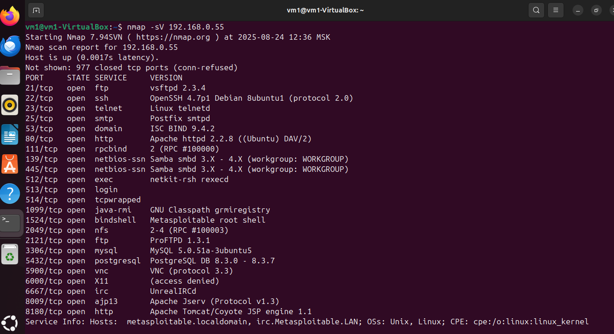

   - Какие уязвимости были вами обнаружены? (список со ссылками: достаточно трёх уязвимостей)

**[ProFTPd IAC 1.3.x](https://www.exploit-db.com/exploits/15449)**
**[vsftpd 2.3.4](https://www.exploit-db.com/exploits/49757)**
**[MySQL 5.0.x - IF Query Handling Remote Denial of Service](https://www.exploit-db.com/exploits/30020)**
**[MySQL 5.0.x - Single Row SubSelect Remote Denial of Service](https://www.exploit-db.com/exploits/29724)**

---

### Задание 2

Проведите сканирование Metasploitable в режимах SYN, FIN, Xmas, UDP.

Запишите сеансы сканирования в Wireshark.

Ответьте на следующие вопросы:

   - Чем отличаются эти режимы сканирования с точки зрения сетевого трафика?
   - Как отвечает сервер?

*Приведите ответ в свободной форме.*

**Режим SYN (-sS)**

При использовании данного режима Nmap посылает SYN пакет и для хоста это выглядит как будто с ним хотят установить реальное соединение. Если приходит ответ SYN/ACK – значит порт открыт, а если RST – значит закрыт, если ответ не приходит или пришло ICMP-сообщение об ошибке – значит порт фильтруется.

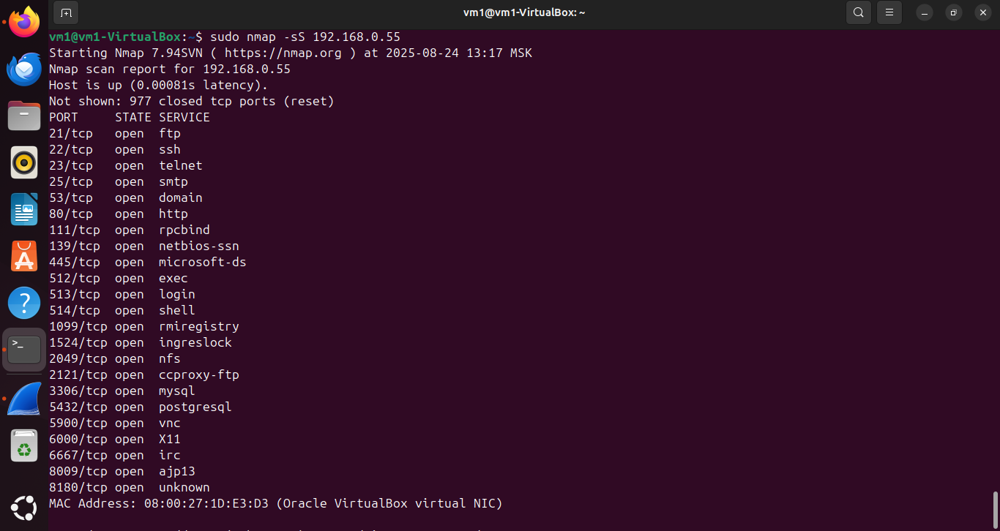
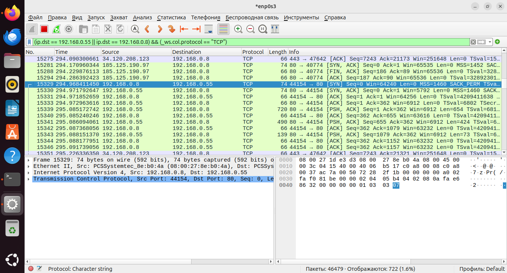

**Режим FIN (-sF)**

FIN - сканирование основано на отправке запросов, содержащих только один установленный флаг контроля соединения - FIN. В отличие от запросов SYN, многие брандмауэры не блокируют такой PDU (Protocol Data Unit). Ответ RST/ACK - порт закрыт. Если ответа нет - порт открыт|фильтруется. 

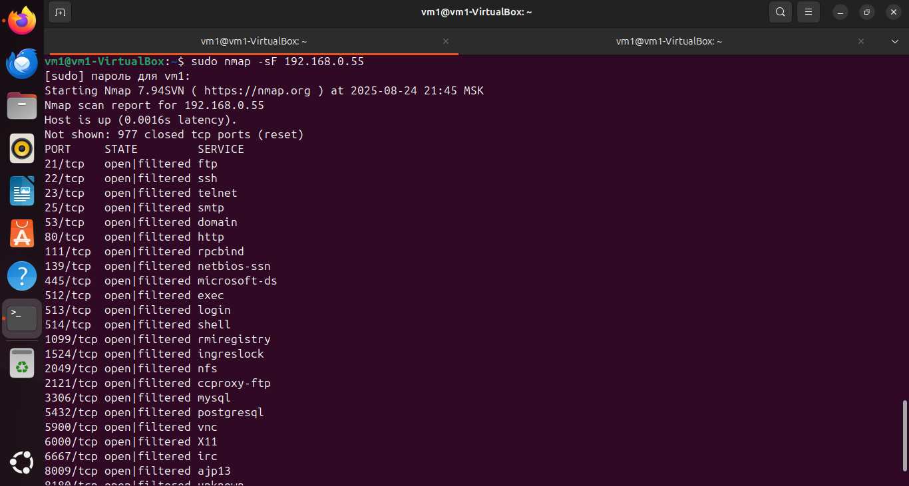
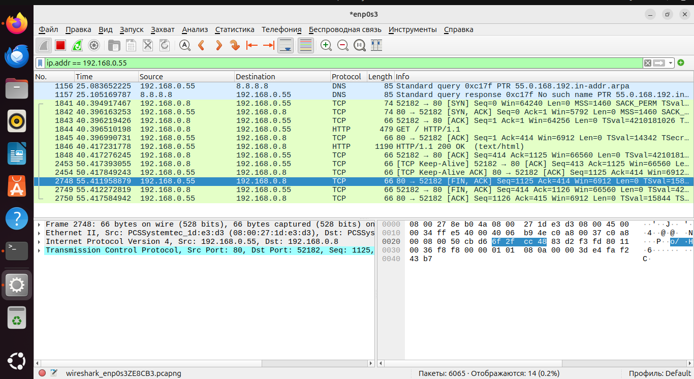

**Режим Xmas (-sX)**

В этом случае TCP-пакеты отсылаются с установленными флагами PSH, URG и FIN. Этот тип также ожидает пакеты RST для closed портов. Ответ RST/ACK - порт закрыт. Если ответа нет - порт открыт|фильтруется. 

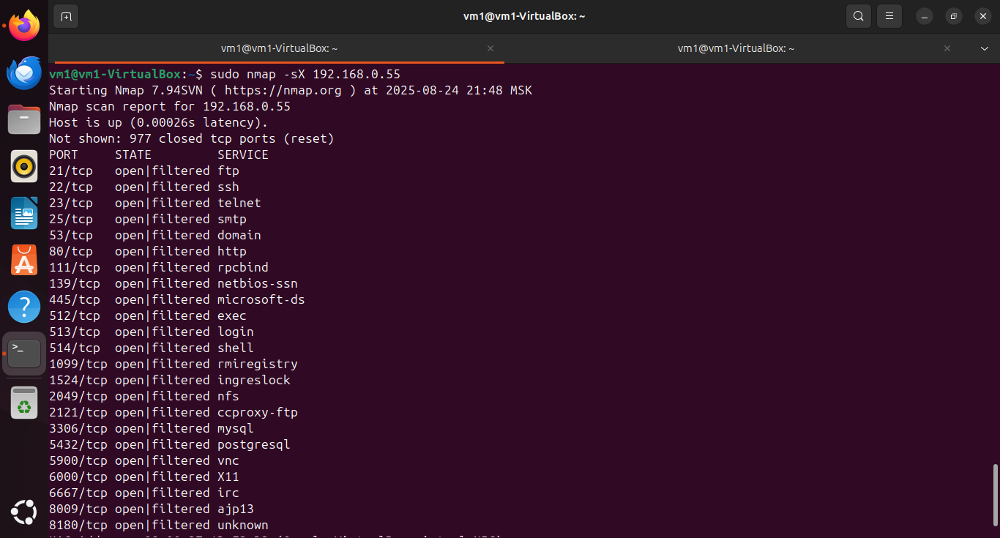
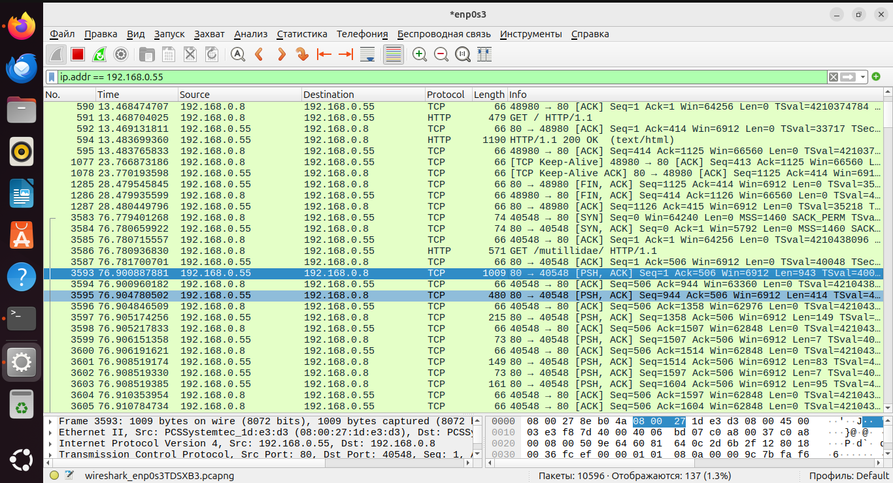

**Режим UDP (-sU)**

Сканирование медленное из-за специфики UDP и возможности потери пакетов запросы повторяются несколько раз (обычно три и более). Отправляет пустой UDP заголовок на каждый порт. Если приходит ошибка “порт недостижим”, то в зависимости от типа ошибки Nmap определяет – порт закрыт или фильтруется, если в ответ пришел UDP – пакет значит порт открыт, а если ответа нет – будет присвоен статус open|filtered. 

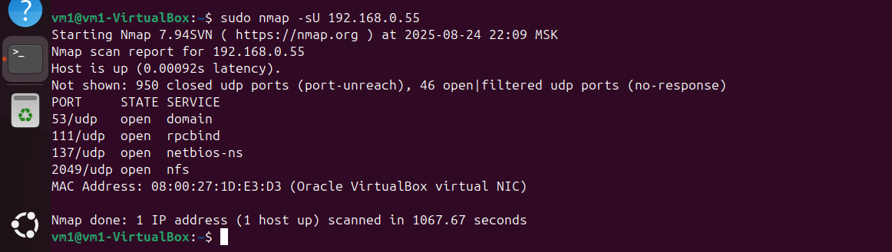
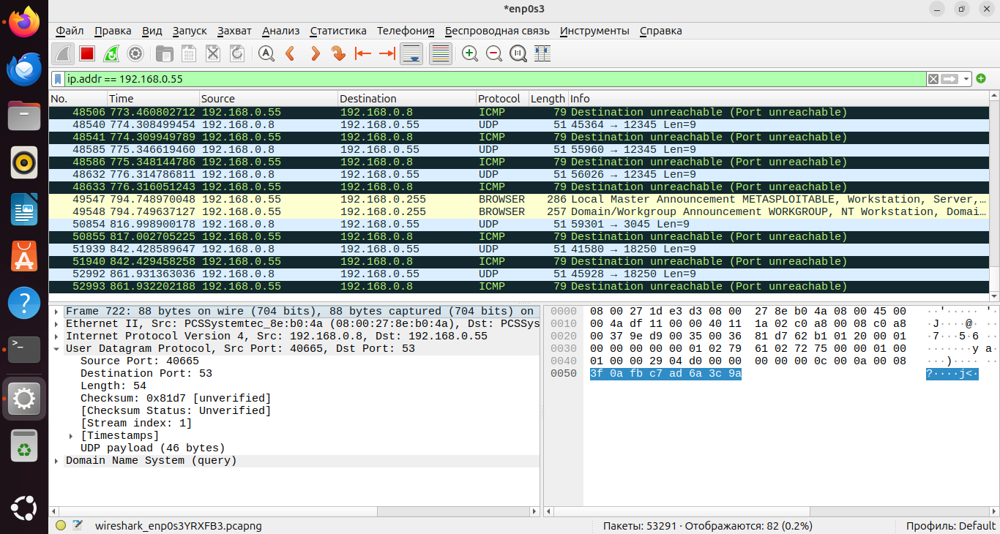

---

